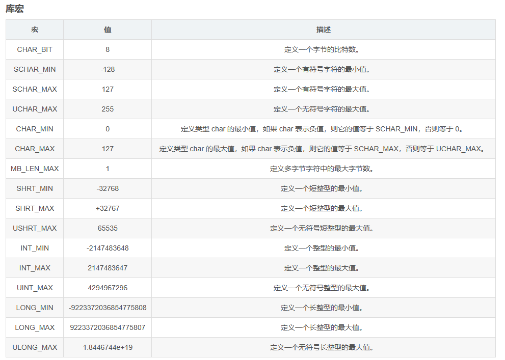

# 语言操作函数  

## stdio.h    

char *gets(char *s) 
从标准设备读取一行字符串放入s所指存储区，用’\0’替换读入的换行符     
返回s,出错返回NULL      

int getchar(void)   
从标准输入设备读取下一个字符    
返回所读字符，若出错或文件结束返回-1    

int puts(char *str)
把str所指字符串输出到标准设备，将’\0’转成回车换行符 
返回换行符，若出错，返回EOF

## math.h   
int abs( int x) 
double fabs(double x)   
double exp(double x) : 返回e的x次方 
double pow(double x,double y)
double sqrt(double x)

double ceil (double); 取上整，返回不比x小的最小整数
double floor (double); 取下整，返回不比x大的最大整数，即 高斯函数[x]

## ctype.h  
int isdigit(int ch) 检查ch是否为数字 是，返回1；否则返回0
int islower(int ch) 
int isupper(int ch) 
int tolower(int ch)  ch改为小写 
int toupper(int ch)  ch改为大写 

## string.h 
char *strcat(char *s1,char *s2)     
把字符串s2接到s1后面    
s1所指地址  

char *strchr(char *s,int ch)    
在s所指字符串中，找出第一次出现**字符ch**的位置     
返回找到的字符的地址，找不到返回NULL    

int strcmp(char *s1,char *s2)   
对s1和s2所指字符串进行比较  
s1小,返回负数；s1= =s2,返回0；s1>s2,返回正数    

char *strcpy(char *s1,char *s2)     
把s2指向的串复制到s1指向的空间  
s1 所指地址 

unsigned strlen(char *s)    
求字符串s的长度
返回串中字符（不计最后的'\0'）个数  

char *strstr(char *s1,char *s2) 
在s1所指字符串中，找出**字符串s2**第一次出现的位置  
返回找到的字符串的地址，找不到返回NULL  

## stdlib.h 
void *free(void *p)  释放p所指的内存区  
void *malloc(unsigned size)  分配size个字节的存储空间;如不成功，返回0   

## limits.h

## 其它 

